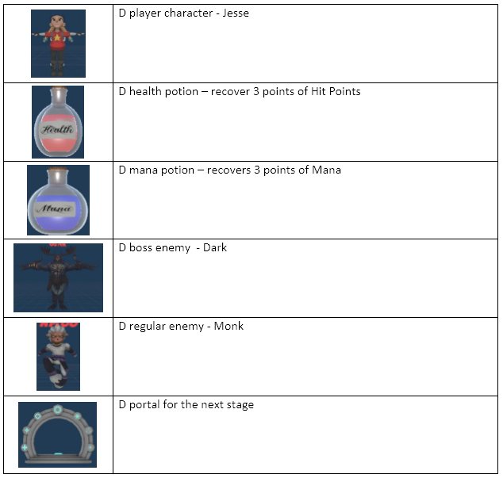

GitHubLogo.png?Style=centerme)

# UNITY ENGINE PROJECT #

#######################################################################

Build - https://philipego.itch.io/d-oder-world

#######################################################################

- 420-JV8-AS - GAME ENGINE I

### Professor: ###

- Marc-Andre Larouche

### Development Team: ###

- Philipe Gouveia

#######################################################################

**Section 1: About the Game**

D Other World is a game where a girl has to go into a 3D world to save her Grand Mother from monsters who had captured her.  
The world starts on a training stage where the player will learn the controls and basics about the game. After the player will dive into the story of the game and play throw some initial stages      
      
**Section 2: About the Manual**

      2.1 - Control Scheme:

      2.2 - Important Visuals:
      

**Section 3: Development Process**

**Section 4: References**

*scenarios assets from* 

1.	designed by Philipe Gouveia

2.	https://sketchfab.com/

3.	https://assetstore.unity.com/packages/essentials/tutorial-projects/book-of-the-dead-environment-121175

*magic ground circles*

1.	by Luke RustLTD, at http://www.opengameart.org/content/4-summoning-circles

*Audio resources*

1.	Supplied by Music Producer @champs.music;

*Coding*

1.	by Philipe Gouveia

*Font*

1.	Heroes Legend by imagex Wanadoo at dafont.com
